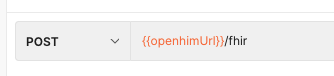
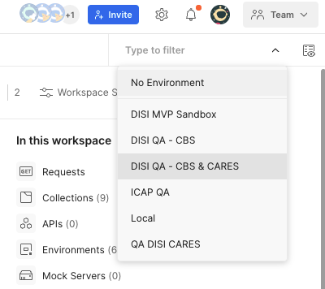

# Postman Collections

**Note**: The CARES on Platform reference implementation supports both COVID-19 and HIV.

In order to view the reference implementation in action, please send messages to the CDR using one of the following Postman Collections:

* [COVID19 Case Reporting](https://www.postman.com/jembi-platform/workspace/jembi-public/collection/23345468-72eafb5d-6ce7-4ccc-abb5-49d76e83b270?action=share\&creator=2252804)
* [COVID19 Lab Integration](https://www.postman.com/jembi-platform/workspace/jembi-public/collection/2252804-7c71737d-d370-4eec-aaa6-2971ff742b8f?action=share\&creator=2252804)

The following FHIR™ API has been established to enable testing:

* [https://openhimcore.qa.cares-disi.gicsandbox.org](https://openhimcore.qa.cares-disi.gicsandbox.org)[/fhir](https://openhimcore.qa.cares.gicsandbox.org/fhir)

The required auth header to use when sending requests to the above API:

* Authorization: Custom test

You can submit data by using the bundles that are available in the Postman Collection but before doing so, it is essential that you first ensure that the request URL is pointing to the appropriate FHIR™ implementation API.

The request URL can be seen at the top left of each message bundle.

All of the Postman Collections make use of the variable \{{openhimURL\}} which is used to dynamically set the appropriate FHIR™ API. You can either replace this variable with the URL you want to use or you can leverage the appropriate Postman Environment to set the openhimURL for you. In order to use a Postman Environment, simply select the appropriate environment on the top right of the Postman application.

**Introduction to the bundles in each Postman Collection:**

1. **COVID-19 Case Reporting**
   1. Submit bundle:
      1. _COVID19 Submit Bundle_: This bundle was established to support the need to measure and monitor individuals diagnosed with COVID-19 and their status towards being up-to-date vaccinated.&#x20;
         * Derived from the COVID19 Case Reporting [FHIR™ Implementation Guide](https://openhie.github.io/covid19-casereporting/index.html).
2. **COVID-19 Lab Integration**
   1.  This collection allows you to perform the following key operations individually:

       1. Submit a new lab order for COVID-19:
          1.  _\[EMR] Submit lab Order Bundle_: Submit a request for a new lab order.

              **Note**: Please follow these steps before submitting a lab order request:

              1. First, submit a request using the "Cares Submit random bundle" so that the patient record is created in the Master Patient Index (MPI).
              2. Generate an `access_token` using the request titled "Generate SanteMPI access\__token" and then copy the text from the JSON response for access\__token.
              3. Using the copied `access_token` from step 2, paste the text to the authorization section for the request titled "Query Patient (First generate access\_token)" using the authorization type of Bearer Token.
              4. Execute the request titled "Query Patient (First generate access\_token)".&#x20;
              5. Using the NID that was specified for the patient during the request in step 1, search for the patient in the JSON response body that was received directly after step 4 was executed.&#x20;
              6.  Search for the object `link[]` that is associated with the found patient NID. For example:

                  .png>)

                  **Note**: The patient identifier as shown in the image above will be used for all lab orders, lab results, and lab rejections.
              7. Make sure that you update your variable value for `patientGuid` to match the one found in the `link[]` object.
              8. Finally, submit your lab order
       2. Result: an existing lab order for COVID-19:
          1.  _\[LAB] Submit lab result Bundle_: Submit a result for an existing lab order.

              ****

              **Note**: Make sure to use the same patient identifier as was used when submitting a lab order.
       3. Reject an existing request for a COVID-19 lab order:
          1.  _\[LAB] Submit lab REJECTION_: Cancels an existing lab order `ServiceRequest`.

              ****

              **Note**: Make sure to use the same patient identifier as was used when submitting a lab order.
       4. Cancel an existing request for a HIV lab order:
          1.  _\[LAB] Submit lab Cancellation_: Cancels an existing lab order `ServiceRequest`.

              ****

              **Note**: Make sure to use the same patient identifier as was used when submitting a lab order.

       **Note**: Lab integration has been incorporated into the FHIR™ Implementation Guides.
